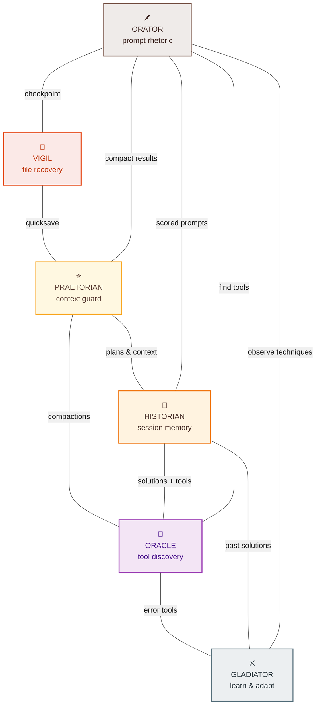

<p align="center">
  <a href="https://github.com/Vvkmnn/claude-emporium"></a>
</p>

<div align="center">
<h1>claude emporium</h1>
<p><em>a (roman) plugin marketplace for claude code</em></p>
</div>

<!-- social -->
<p align="center">
<a href="https://github.com/Vvkmnn"></a>
&nbsp;
<a href="https://github.com/Vvkmnn/claude-emporium"></a>
</p>

<!-- tech -->
<p align="center">
<a href="https://opensource.org/licenses/MIT"></a>
<a href="https://claude.ai/code"></a>
<a href="https://modelcontextprotocol.io/"></a>
<a href="https://www.typescriptlang.org/"></a>
<a href="https://nodejs.org/"></a>
</p>

<!-- npm versions -->
<p align="center">
<a href="https://www.npmjs.com/package/claude-praetorian-mcp"></a>
<a href="https://www.npmjs.com/package/claude-historian-mcp"></a>
<a href="https://www.npmjs.com/package/claude-oracle-mcp"></a>
<a href="https://www.npmjs.com/package/claude-gladiator-mcp"></a>
<a href="https://www.npmjs.com/package/claude-vigil-mcp"></a>
<a href="https://www.npmjs.com/package/claude-orator-mcp"></a>
</p>

<p align="center">
<a href="#install">install</a>&nbsp;&nbsp;&nbsp;<a href="#plugins">plugins</a>&nbsp;&nbsp;&nbsp;<a href="#synergy">synergy</a>&nbsp;&nbsp;&nbsp;<a href="#architecture">architecture</a>&nbsp;&nbsp;&nbsp;<a href="#contributing">contributing</a>
</p>

<p align="center">
  <sup><em>roma victrix</em></sup>
</p>

---

Six plugins that wrap standalone MCP servers with automation hooks, commands, and skills. No code duplication: plugins tell claude _when_ to act, MCPs handle _how_.

```
╔═╤═══════════════════════════════════════════════════════════════════════════════════════════════════════════════════════════════════════════╤═╗
║ │                                                                                                                                           │ ║
║ │ PLUGINS                                                                                                                                   │ ║
║ │                                                                                                                                           │ ║
║ │ ┌────────────────────┐ ┌────────────────────┐ ┌────────────────────┐ ┌────────────────────┐ ┌────────────────────┐ ┌────────────────────┐ │ ║
║ │ │   PRAETORIAN       │ │   HISTORIAN        │ │   ORACLE           │ │   GLADIATOR        │ │   VIGIL            │ │   ORATOR           │ │ ║
║ │ │ context guard      │ │ session memory     │ │ tool discovery     │ │ learn & adapt      │ │ file recovery      │ │ prompt rhetoric    │ │ ║
║ │ ├────────────────────┤ ├────────────────────┤ ├────────────────────┤ ├────────────────────┤ ├────────────────────┤ ├────────────────────┤ │ ║
║ │ │ hooks              │ │ hooks              │ │ hooks              │ │ hooks              │ │ hooks              │ │ hooks              │ │ ║
║ │ │ · pre-plan         │ │ · pre-websearch    │ │ · pre-plan         │ │ · post-error       │ │ · pre-bash         │ │ · pre-task         │ │ ║
║ │ │ · pre-compact      │ │ · pre-plan         │ │ · post-error       │ │ · stop             │ │                    │ │                    │ │ ║
║ │ │ · post-research    │ │ · pre-task         │ │                    │ │                    │ │ commands           │ │ commands           │ │ ║
║ │ │ · subagent-stop    │ │ · post-error       │ │ commands           │ │ commands           │ │ · /save-vigil      │ │ · /reprompt-       │ │ ║
║ │ │                    │ │                    │ │ · /search-oracle   │ │ · /review-         │ │ · /restore-vigil   │ │   orator           │ │ ║
║ │ │ commands           │ │ commands           │ │                    │ │   gladiator        │ │                    │ │                    │ │ ║
║ │ │ · /compact-        │ │ · /search-         │ │                    │ │                    │ │                    │ │                    │ │ ║
║ │ │   praetorian       │ │   historian        │ │                    │ │                    │ │                    │ │                    │ │ ║
║ │ │ · /restore-        │ │                    │ │                    │ │                    │ │                    │ │                    │ │ ║
║ │ │   praetorian       │ │                    │ │                    │ │                    │ │                    │ │                    │ │ ║
║ │ └────────────────────┘ └────────────────────┘ └────────────────────┘ └────────────────────┘ └────────────────────┘ └────────────────────┘ │ ║
║ │            │                      │                      │                      │                      │                      │           │ ║
║ │            ▼                      ▼                      ▼                      ▼                      ▼                      ▼           │ ║
║ │                                                                                                                                           │ ║
║ │ ┌────────────────────┐ ┌────────────────────┐ ┌────────────────────┐ ┌────────────────────┐ ┌────────────────────┐ ┌────────────────────┐ │ ║
║ │ │ praetorian-mcp     │ │ historian-mcp      │ │ oracle-mcp         │ │ gladiator-mcp      │ │ vigil-mcp          │ │ orator-mcp         │ │ ║
║ │ ├────────────────────┤ ├────────────────────┤ ├────────────────────┤ ├────────────────────┤ ├────────────────────┤ ├────────────────────┤ │ ║
║ │ │ save_context       │ │ search_convos      │ │ search             │ │ observe            │ │ vigil_save         │ │ orator_optimize    │ │ ║
║ │ │ · snapshot before  │ │ · full-text across │ │ · query 17 sources │ │ · record patterns  │ │ · named checkpoint │ │ · score 7 dims     │ │ ║
║ │ │   compaction       │ │   all sessions     │ │   in parallel      │ │                    │ │                    │ │ · apply 8 techs    │ │ ║
║ │ │                    │ │                    │ │                    │ │ reflect            │ │ vigil_list         │ │ · restructure      │ │ ║
║ │ │ restore_context    │ │ get_error_solns    │ │ browse             │ │ · cluster and      │ │ · show checkpoints │ │                    │ │ ║
║ │ │ · load previous    │ │ · how errors were  │ │ · by category or   │ │   recommend        │ │                    │ │ ── ── ── ── ──     │ │ ║
║ │ │   session state    │ │   resolved         │ │   popularity       │ │                    │ │ vigil_diff         │ │ dimensions:        │ │ ║
║ │ │                    │ │                    │ │                    │ │ ── ── ── ── ──     │ │ · preview changes  │ │ clarity            │ │ ║
║ │ │ search_compactns   │ │ find_similar       │ │ sources            │ │ storage:           │ │                    │ │ specificity        │ │ ║
║ │ │ · find past saves  │ │ · related past     │ │ · list registries  │ │ .claude/           │ │ vigil_restore      │ │ structure          │ │ ║
║ │ │                    │ │   questions        │ │   and status       │ │ gladiator/         │ │ · restore files    │ │ context            │ │ ║
║ │ │ list_compactions   │ │                    │ │                    │ │                    │ │                    │ │ examples           │ │ ║
║ │ │ · browse recent    │ │ find_file_context  │ │ ── ── ── ── ──     │ │                    │ │ vigil_delete       │ │ constraints        │ │ ║
║ │ │   snapshots        │ │ · track changes    │ │ smithery · glama   │ │                    │ │ · remove checkpoint│ │ tone               │ │ ║
║ │ │                    │ │                    │ │ npm · github       │ │                    │ │                    │ │                    │ │ ║
║ │ │ ── ── ── ── ──     │ │ find_tool_pattns   │ │ awesome-mcp        │ │                    │ │ ── ── ── ── ──     │ │ ── ── ── ── ──     │ │ ║
║ │ │ storage:           │ │ · agent workflows  │ │ mcp-registry       │ │                    │ │ storage:           │ │ in-memory          │ │ ║
║ │ │ .claude/           │ │                    │ │ + 11 more          │ │                    │ │ .claude/           │ │ zero storage       │ │ ║
║ │ │ praetorian/        │ │ search_plans       │ │                    │ │                    │ │ vigil/             │ │                    │ │ ║
║ │ │                    │ │ · past plans       │ │ in-memory cache    │ │                    │ │                    │ │                    │ │ ║
║ │ │                    │ │                    │ │ zero storage       │ │                    │ │                    │ │                    │ │ ║
║ │ │                    │ │ list_recent        │ │                    │ │                    │ │                    │ │                    │ │ ║
║ │ │                    │ │ · recent sessions  │ │                    │ │                    │ │                    │ │                    │ │ ║
║ │ └────────────────────┘ └────────────────────┘ └────────────────────┘ └────────────────────┘ └────────────────────┘ └────────────────────┘ │ ║
║ │                                                                                                                                           │ ║
║ │                                                                                                                               MCP SERVERS │ ║
╚═╧═══════════════════════════════════════════════════════════════════════════════════════════════════════════════════════════════════════════╧═╝
```

## install

Each plugin self-configures on install. MCP servers, hooks, commands, skills, and sibling detection all register automatically. All hooks default to enabled. See [configuration](#configuration) to disable specific hooks or tune behavior.

**Requirements:**

[![Claude Code](https://img.shields.io/badge/Claude_Code-555?logo=data:image/svg%2bxml;base64,PHN2ZyB4bWxucz0iaHR0cDovL3d3dy53My5vcmcvMjAwMC9zdmciIHZpZXdCb3g9IjAgMCAxOCAxMCIgc2hhcGUtcmVuZGVyaW5nPSJjcmlzcEVkZ2VzIj4KICA8IS0tIENsYXdkOiBDbGF1ZGUgQ29kZSBtYXNjb3QgLS0+CiAgPCEtLSBEZWNvZGVkIGZyb206IOKWkOKWm+KWiOKWiOKWiOKWnOKWjCAvIOKWneKWnOKWiOKWiOKWiOKWiOKWiOKWm+KWmCAvIOKWmOKWmCDilp3ilp0gLS0+CiAgPCEtLSBTdWItcGl4ZWxzIGFyZSAxIHdpZGUgeCAyIHRhbGwgdG8gbWF0Y2ggdGVybWluYWwgY2hhciBjZWxsIGFzcGVjdCByYXRpbyAtLT4KICA8cmVjdCBmaWxsPSIjZDk3NzU3IiB4PSIzIiAgeT0iMCIgd2lkdGg9IjEyIiBoZWlnaHQ9IjIiLz4KICA8cmVjdCBmaWxsPSIjZDk3NzU3IiB4PSIzIiAgeT0iMiIgd2lkdGg9IjIiICBoZWlnaHQ9IjIiLz4KICA8cmVjdCBmaWxsPSIjZDk3NzU3IiB4PSI2IiAgeT0iMiIgd2lkdGg9IjYiICBoZWlnaHQ9IjIiLz4KICA8cmVjdCBmaWxsPSIjZDk3NzU3IiB4PSIxMyIgeT0iMiIgd2lkdGg9IjIiICBoZWlnaHQ9IjIiLz4KICA8cmVjdCBmaWxsPSIjZDk3NzU3IiB4PSIxIiAgeT0iNCIgd2lkdGg9IjE2IiBoZWlnaHQ9IjIiLz4KICA8cmVjdCBmaWxsPSIjZDk3NzU3IiB4PSIzIiAgeT0iNiIgd2lkdGg9IjEyIiBoZWlnaHQ9IjIiLz4KICA8cmVjdCBmaWxsPSIjZDk3NzU3IiB4PSI0IiAgeT0iOCIgd2lkdGg9IjEiICBoZWlnaHQ9IjIiLz4KICA8cmVjdCBmaWxsPSIjZDk3NzU3IiB4PSI2IiAgeT0iOCIgd2lkdGg9IjEiICBoZWlnaHQ9IjIiLz4KICA8cmVjdCBmaWxsPSIjZDk3NzU3IiB4PSIxMSIgeT0iOCIgd2lkdGg9IjEiICBoZWlnaHQ9IjIiLz4KICA8cmVjdCBmaWxsPSIjZDk3NzU3IiB4PSIxMyIgeT0iOCIgd2lkdGg9IjEiICBoZWlnaHQ9IjIiLz4KPC9zdmc+Cg==)](https://claude.ai/code)

**Marketplace:**

```bash
# Add this marketplace
/plugin marketplace add Vvkmnn/claude-emporium
```

**Plugins:**

```bash
# Each registers its MCP server, skills, hooks, settings, and detects siblings automatically
/plugin install claude-praetorian@claude-emporium
/plugin install claude-historian@claude-emporium
/plugin install claude-oracle@claude-emporium
/plugin install claude-gladiator@claude-emporium
/plugin install claude-vigil@claude-emporium
/plugin install claude-orator@claude-emporium
```

**MCP servers:**

```bash
# NOT REQUIRED: Each plugin will install their MCP server by themself
# However, you can choose to install just the MCP servers if you like
# Standalone has no hooks or synergy, but each ships with an optionally installable skill
# claude mcp add praetorian -- npx claude-praetorian-mcp  # https://github.com/Vvkmnn/claude-praetorian-mcp
# claude mcp add historian -- npx claude-historian-mcp    # https://github.com/Vvkmnn/claude-historian-mcp
# claude mcp add oracle -- npx claude-oracle-mcp          # https://github.com/Vvkmnn/claude-oracle-mcp
# claude mcp add gladiator -- npx claude-gladiator-mcp    # https://github.com/Vvkmnn/claude-gladiator-mcp
# claude mcp add vigil -- npx claude-vigil-mcp            # https://github.com/Vvkmnn/claude-vigil-mcp
# claude mcp add orator -- npx claude-orator-mcp          # https://github.com/Vvkmnn/claude-orator-mcp
```

## plugins

<h3>praetorian</h3>

<a href="https://github.com/Vvkmnn/claude-praetorian-mcp"></a>

**Context Guard**. Saves and restores valuable context before compaction, after research, and when subagents complete.

**mcp:** [`claude-praetorian-mcp`](https://www.npmjs.com/package/claude-praetorian-mcp) (storage at `.claude/praetorian/`)

<br clear="left"/>

**commands:**

- `/compact-praetorian` · save insights after research, decisions, or subagent work
- `/restore-praetorian` · load relevant past compactions at session start

**tools:**

- `praetorian_compact` · save structured context: research, decisions, flow analysis
- `praetorian_restore` · search or list recent compactions by query or type

**hooks:**

- `PreToolUse` on `EnterPlanMode` · lists prior compactions before planning
- `PreCompact` on `*` · saves context before compaction resets it
- `PostToolUse` on `WebFetch` / `WebSearch` · prompts to compact research findings
- `SubagentStop` on `*` · prompts to compact subagent results

---

<h3>historian</h3>

<a href="https://github.com/Vvkmnn/claude-historian-mcp"></a>

**Session searcher**. Checks past sessions before you do redundant research, planning, or debugging to find solutions or insights we can recycle.

**mcp:** [`claude-historian-mcp`](https://www.npmjs.com/package/claude-historian-mcp) (9 search tools across conversations, errors, files, plans)

<br clear="left"/>

**commands:**

- `/search-historian` · search past sessions for solutions, patterns, or context

**tools:**

- `search_conversations` · search conversation history, .claude files, and tasks
- `find_file_context` · find all conversations related to a specific file
- `find_similar_queries` · find previous similar questions with enhanced matching
- `get_error_solutions` · find solutions for specific errors
- `list_recent_sessions` · browse recent sessions with activity summaries
- `extract_compact_summary` · get intelligent summary of a session with key insights
- `find_tool_patterns` · analyze tool usage patterns and workflows
- `search_plans` · search plan files for past approaches and decisions
- `search_config` · search .claude config files for guidance and patterns

**hooks:**

- `PreToolUse` on `WebSearch` / `WebFetch` · checks history before web research
- `PreToolUse` on `EnterPlanMode` · searches past plans before planning
- `PreToolUse` on `Task` · checks tool patterns before launching agents
- `PostToolUse` on `Bash` · suggests error solutions after failures

---

<h3>oracle</h3>

<a href="https://github.com/Vvkmnn/claude-oracle-mcp"></a>

**Tool recommender**. Searches 17 sources in parallel to find relevant skills, plugins, and MCP servers.

**mcp:** [`claude-oracle-mcp`](https://www.npmjs.com/package/claude-oracle-mcp) (smithery, glama, npm, github, awesome-mcp-servers, and more)

<br clear="left"/>

**commands:**

- `/search-oracle` · search all sources for skills, plugins, or MCP servers

**tools:**

- `search` · search by query with optional type and semantic filters
- `browse` · browse by category or popularity
- `sources` · show available data sources and their status

**hooks:**

- `PreToolUse` on `EnterPlanMode` · searches for relevant tools before planning
- `PostToolUse` on `Bash` · searches for tools that solve errors

---

<h3>gladiator</h3>

<a href="https://github.com/Vvkmnn/claude-gladiator-mcp"></a>

**Continuous learner**. Observes tool failures and prompts reflection at session end to evolve rules, hooks, and skills incrementally.

**mcp:** [`claude-gladiator-mcp`](https://www.npmjs.com/package/claude-gladiator-mcp) (storage at `.claude/gladiator/`)

<br clear="left"/>

**commands:**

- `/review-gladiator` · review and cluster observations into actionable patterns

**tools:**

- `gladiator_observe` · record a pattern worth learning from, deduplicates by hash
- `gladiator_reflect` · query and cluster observations with recommendations

**hooks:**

- `PostToolUse` on `Bash` / `Edit` / `Write` · observes failure patterns (silent on success)
- `Stop` on `*` · prompts reflection if unprocessed observations exist

---

<h3>vigil</h3>

<a href="https://github.com/Vvkmnn/claude-vigil-mcp"></a>

**Quick saver**. Saves checkpoints before dangerous operations, diffs changes, restores files safely to augment `/rewind`.

**mcp:** [`claude-vigil-mcp`](https://www.npmjs.com/package/claude-vigil-mcp) (storage at `.claude/vigil/`)

<br clear="left"/>

**commands:**

- `/save-vigil` · create a named checkpoint of tracked files
- `/restore-vigil` · restore files from a previous checkpoint

**tools:**

- `vigil_save` · save a named checkpoint with optional description
- `vigil_list` · list checkpoints, drill into one for file details
- `vigil_diff` · diff current files against a checkpoint
- `vigil_restore` · restore files from a checkpoint
- `vigil_delete` · delete a checkpoint or all checkpoints

**hooks:**

- `PreToolUse` on `Bash` · auto-quicksaves before destructive commands (rm, mv, etc.)

---

<h3>orator</h3>

<a href="https://github.com/Vvkmnn/claude-orator-mcp"></a>

**Prompt coach**. Deterministically scores and restructures prompts using Anthropic best practices. No LLM calls, no network, in-memory only.

**mcp:** [`claude-orator-mcp`](https://www.npmjs.com/package/claude-orator-mcp) (in-memory, zero storage)

<br clear="left"/>

**commands:**

- `/reprompt-orator` · score and optimize a prompt with detailed feedback

**tools:**

- `orator_optimize` · analyze and optimize a prompt, returns score metrics and applied techniques

**hooks:**

- `PreToolUse` on `Task` · suggests optimization for under-specified subagent prompts

## architecture

Each plugin is a thin wrapper. hooks inject prompts that trigger MCP tools at high-impact moments. plugins contain no business logic: they tell claude _when_ to search, save, or restore. the MCP servers handle the actual work.

```
claude-emporium/
├── .claude-plugin/
│   ├── marketplace.json                    plugin registry (6 plugins)
│   └── plugin.json                         root manifest
│
├── plugins/
│   ├── claude-praetorian/                  context guard → praetorian-mcp
│   │   ├── .claude-plugin/plugin.json      declares praetorian MCP server
│   │   ├── hooks/
│   │   │   ├── hooks.json                  hook event bindings
│   │   │   ├── post-research.js            compact after WebSearch/WebFetch
│   │   │   ├── post-subagent.js            compact after Task completes
│   │   │   ├── pre-compact.js              remind to compact before context reset
│   │   │   └── pre-plan.js                 list prior compactions before planning
│   │   ├── commands/
│   │   │   ├── compact-praetorian.md       /compact
│   │   │   └── restore-praetorian.md       /compact-status
│   │   ├── skills/claude-praetorian/SKILL.md
│   │   └── README.md
│   │
│   ├── claude-historian/                   session memory → historian-mcp
│   │   ├── .claude-plugin/plugin.json      declares historian MCP server
│   │   ├── hooks/
│   │   │   ├── hooks.json
│   │   │   ├── pre-websearch.js            check history before web research
│   │   │   ├── pre-planning.js             search past plans before planning
│   │   │   ├── pre-task.js                 check tool patterns before agents
│   │   │   └── post-error.js               suggest past error solutions
│   │   ├── commands/search-historian.md    /history
│   │   ├── skills/claude-historian/SKILL.md
│   │   └── README.md
│   │
│   ├── claude-oracle/                      tool discovery → oracle-mcp
│   │   ├── .claude-plugin/plugin.json      declares oracle MCP server
│   │   ├── hooks/
│   │   │   ├── hooks.json
│   │   │   ├── pre-planning.js             search registries before planning
│   │   │   └── post-error.js               find tools that solve errors
│   │   ├── commands/search-oracle.md       /discover
│   │   ├── skills/claude-oracle/SKILL.md
│   │   └── README.md
│   │
│   ├── claude-gladiator/                   learn & adapt → gladiator-mcp
│   │   ├── .claude-plugin/plugin.json      declares gladiator MCP server
│   │   ├── hooks/
│   │   │   ├── hooks.json
│   │   │   ├── stop.js                     prompt reflection at session end
│   │   │   └── post-error.js               observe failure patterns
│   │   ├── commands/review-gladiator.md    /observe · /reflect
│   │   ├── skills/claude-gladiator/SKILL.md
│   │   └── README.md
│   │
│   ├── claude-vigil/                       file recovery → vigil-mcp
│   │   ├── .claude-plugin/plugin.json      declares vigil MCP server
│   │   ├── hooks/
│   │   │   ├── hooks.json
│   │   │   └── pre-bash.js                 quicksave before rm/reset/checkout
│   │   ├── commands/
│   │   │   ├── save-vigil.md               /save
│   │   │   └── restore-vigil.md            /restore · /snapshots
│   │   ├── skills/claude-vigil/SKILL.md
│   │   └── README.md
│   │
│   ├── claude-orator/                      prompt rhetoric → orator-mcp
│   │   ├── .claude-plugin/plugin.json      declares orator MCP server
│   │   ├── hooks/
│   │   │   ├── hooks.json
│   │   │   └── pre-task.js                 optimize prompts before subagents
│   │   ├── commands/reprompt-orator.md     /optimize
│   │   ├── skills/claude-orator/SKILL.md
│   │   └── README.md
│   │
│   └── shared/
│       └── utils.js                        loadSettings · siblings · readStdin · emit
│
├── mcp/
│   └── .mcp.json                           all 6 MCP servers (standalone install)
│
├── logo/                                   plugin SVG icons
├── .github/                                issue templates · PR template · CI workflows
├── scripts/readme.py                       README generation
└── README.md

each plugin.json declares its MCP server:
  { "mcpServers": { "praetorian": { "command": "npx", "args": ["claude-praetorian-mcp"] } } }

each hook script follows the same pattern:
  readStdin() → loadSettings() → siblings() → emit(<system-reminder>)

runtime storage:
  project/.claude/praetorian/   context snapshots
  project/.claude/gladiator/    observations + reflections
  project/.claude/vigil/        file checkpoints
  ~/.claude/settings.json       enabledPlugins (auto) · claude-emporium (manual)
```

**zero overhead, by design:**

- no external API calls. no network requests from hooks or plugins
- no background processes. hooks run inline and exit (~1ms each)
- no databases. praetorian, gladiator, and vigil store to project-local dirs (`.claude/`). oracle, historian, and orator compute in-memory with TTL caching
- no dependencies beyond Node.js (ships with Claude Code)
- all hook scripts are pure Node.js, single-purpose, and stateless
- built for claude, by claude

## configuration

**Sibling detection:** `/plugin install` adds each plugin to `enabledPlugins` in `~/.claude/settings.json`. Hooks read this to detect siblings and coordinate automatically. For example, historian's pre-research hook will note "praetorian will compact this" when both are installed, and oracle's error hook will mention "historian can search past solutions" if historian is present. This is what sibling detection looks like:

```jsonc
// ~/.claude/settings.json
{
  // ...model, permissions, apiKey, etc.
  "enabledPlugins": {
    // ...other installed plugins
    "claude-praetorian@claude-emporium": true, // detected as sibling by all other plugins
    "claude-historian@claude-emporium": true, // detected as sibling by all other plugins
    "claude-oracle@claude-emporium": true,
    // ...added automatically by /plugin install
  },
  // ...
}
```

**Hook settings:** every hook checks a boolean setting before running. All default to `true`. To disable any hook, add overrides under the `claude-emporium` key in `~/.claude/settings.json`:

```jsonc
// ~/.claude/settings.json
{
  "claude-emporium": {
    "suggest_siblings": false, // stop suggesting uninstalled emporium plugins

    "claude-praetorian": {
      "auto_compact_research": false, // don't prompt to compact after WebFetch/WebSearch
      "auto_compact_subagent": false, // don't prompt to compact after subagent completes
      "check_compactions_before_plan": false, // don't list prior compactions before planning
      "remind_compact": false, // don't remind to compact before context reset
    },
    "claude-historian": {
      "search_before_web": false, // don't check history before web research
      "search_before_plan": false, // don't search past plans before planning
      "search_before_task": false, // don't check tool patterns before launching agents
      "search_after_error": false, // don't suggest error solutions after failures
    },
    "claude-oracle": {
      "search_before_plan": false, // don't search for relevant tools before planning
      "search_after_error": false, // don't search for tools that solve errors
    },
    "claude-gladiator": {
      "observe_after_failure": false, // don't record failure patterns
      "reflect_before_stop": false, // don't prompt reflection at session end
    },
    "claude-vigil": {
      "auto_quicksave": false, // don't quicksave before destructive commands
    },
    "claude-orator": {
      "optimize_subagent_prompts": false, // don't suggest prompt optimization before Task
    },
  },
}
```

Only include the settings you want to change. Omitted keys keep their defaults (`true`). The full defaults are defined in [`shared/utils.js`](plugins/shared/utils.js).

## synergy

Each plugin works standalone. when multiple are installed, they **detect siblings at runtime and coordinate**, usually without any extra configuration.

<!--
  ASCII snapshot (closest WIP — alignment breaks in monospace due to emoji width):

        VIGIL ──────────[5]──────────── PRAETORIAN ──────────[1]──────────── HISTORIAN
     file recovery                      context guard                      session memory
          |                               |  |   \                          / |  |
          |                              [2] [9]  [7]                    [8]  | [10]
          |                               |  |       \                  /     |  |
         [11]                          ORACLE  \       --------+-------    [4] [6]
          |                         tool discovery\            |           |   |
          |                            |    |      --------+---|--------   |   |
          |                           [3]  [10]            |   |       |  |   |
          |                            |    |              |   |       |  |   |
          +------------ ORATOR --------+----+-------- GLADIATOR ------+--+   |
                     prompt rhetoric                   learn & adapt         |

      [1]  praetorian <> historian    past plans & context shared
      [2]  praetorian <> oracle       oracle discoveries in compactions
      [3]  oracle <> gladiator        tools found for error patterns
      [4]  historian <> gladiator     past solutions enrich reflection
      [5]  vigil <> praetorian        quicksave + context saved together
      [6]  historian <> oracle        past solutions + tool search
      [7]  praetorian <> historian    web search findings compacted
      [8]  orator <> historian        past well-scored prompts as examples
      [9]  orator <> praetorian       compact optimized results
      [10] orator <> gladiator        observe which techniques improve scores
      [11] orator <> vigil            checkpoint before batch rewrites
      [12] orator <> oracle           find prompt engineering tools
-->



**Enhanced behaviors when siblings are detected:**

| event    | plugin          | alone                            | with siblings                                 |
| -------- | --------------- | -------------------------------- | --------------------------------------------- |
| plan     | ⚜️ praetorian   | lists prior compactions          | + 📜 past plans, 🔮 finds tools               |
| plan     | 📜 historian    | searches past plans              | + 🔮 also searches for tools                   |
| plan     | 🔮 oracle       | searches 17 registries           | + 📜 past plans, ⚜️ compactions                |
| compact  | ⚜️ praetorian   | snapshots context                | + 🔮 discoveries included                      |
| error    | 📜 historian    | searches past solutions          | + 🔮 finds tools for this error class          |
| error    | 🔮 oracle       | searches for error-solving tools | + 📜 checks past solutions                     |
| error    | ⚔️ gladiator    | observes failure pattern         | + 📜 enriches with past solutions               |
| research | 📜 historian    | checks history first             | + ⚜️ compacts findings after                    |
| subagent | ⚜️ praetorian   | prompts to compact results       | + ⚔️ observes subagent outcome patterns         |
| task     | 📜 historian    | checks tool patterns             | + 🔮 suggests tools for the task                |
| task     | 🪶 orator       | optimizes vague prompts          | + 📜 searches past scored prompts               |
| stop     | ⚔️ gladiator    | prompts reflection               | + 📜 and 🔮 deepen analysis                    |
| bash     | 🏺 vigil        | quicksaves before destructive    | + ⚜️ preserves context alongside                |

Detection is automatic via one `fs.readFileSync` call (~1ms), and falls back gracefully to solo mode if settings are missing or siblings are not dedicated.

## contributing

Bug fixes, improvements, and documentation PRs are welcome, as are inspirations for new plugins and MCPs that could improve synergy and coverage. See [CONTRIBUTING.md](.github/CONTRIBUTING.md) for full guidelines.

- **Issues:** use the [issue templates](https://github.com/Vvkmnn/claude-emporium/issues/new/choose). Bug reports, feature requests, and plugin ideas each have their own form, but please check [open issues](https://github.com/Vvkmnn/claude-emporium/issues) for duplicates first.

- **PRs:** Fork, branch, and follow the [PR template](.github/PULL_REQUEST_TEMPLATE.md). Good contributions include better hook triggers, bug fixes, documentation, and performance improvements, and any novelties that improve experience or perforamnce.

* **New plugins:** Please Open a plugin idea issue; always looking for plugins that have clear trigger events, often wrap specific MCPs, or provide obvious synergy with their sibling plugins. Above all, always looking to solve a concrete user pain for other Claude users.

## troubleshooting

- **plugin not triggering?** Verify the mcp server is running: `claude mcp list`

- **mcp not found?** Install via npm: `claude mcp add <name> -- npx <package>`

- **hook errors?** Check that node.js is available and `CLAUDE_PLUGIN_ROOT` is set.

## license

MIT

---

<p align="center">
  
  <br>
  <sub><a href="https://en.wikipedia.org/wiki/The_Course_of_Empire_(paintings)"><b>The Consummation of Empire</b></a> — <a href="https://en.wikipedia.org/wiki/Thomas_Cole"><b>Thomas Cole</b></a>, 1836</sub>
  <br><br>
  <em>"alea iacta est" | the die is cast</em>
  <br>
  <sub>— <a href="https://en.wikipedia.org/wiki/Julius_Caesar">Julius Caesar</a>, crossing the Rubicon</sub>
</p>
